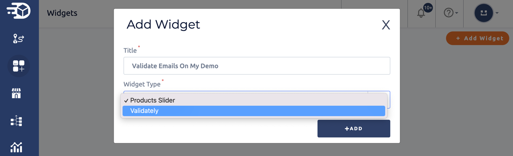
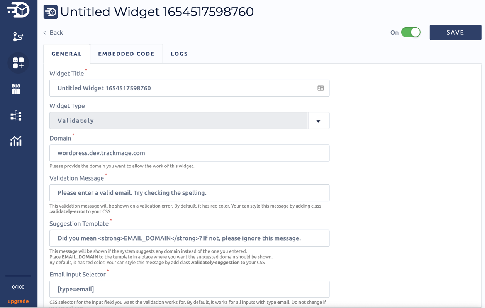
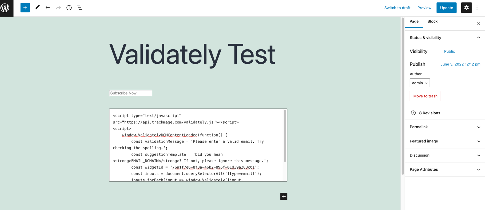
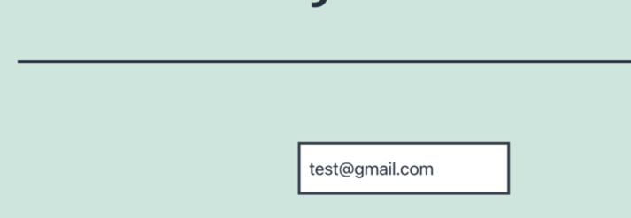
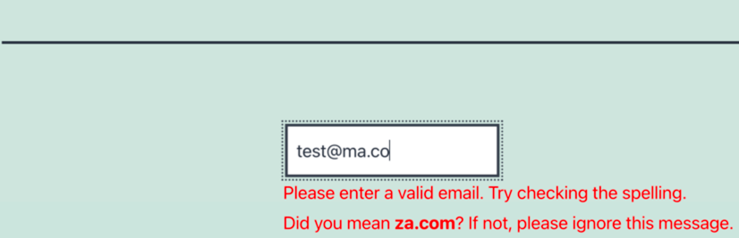
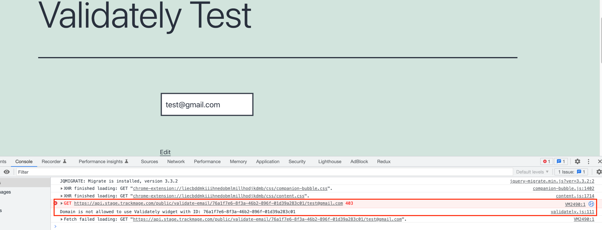
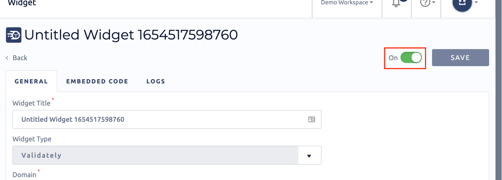

## Introduction

<p>In this article we will look at configure, usage and troubleshooting of <strong>Email Validation Script</strong> widget.</p>
<p>TrackMage provides the opportunity to validate your customers' emails on your store website using the <strong>Email Validation Script</strong> widget.</p>
<p>The widget is easily embedded on any of your pages (such as registration, check-out, etc.) and checks the entered email in real-time.</p>

## Configure Widget

<p>Before configure Email Validation Script widget please go to widgets page and add new Email Validation Script widget:</p>

### Add Email Validation Script widget in your TrackMage account

- Go to widgets page


- Add new Email Validation Script Widget



### Modify widget options

For the widget it is possible to set some options:
- **Domain** - the domain name you want to allow the work of widget.
- **Validation Message** - Validation message will be shown on a validation error.
- **Suggestion Template** - Suggestion message will be shown if the system suggests any domain instead of the one you entered. Place **EMAIL_DOMAIN** to the template in a place where you want the suggested domain should be shown.
- **Email Input Selector** - CSS selector for the input fields you want the validation works for. By default, it works for all inputs **[type=email]** on the page. Do not change if you are not sure.



:::note
All options are required. But only **Domain** does not have a default value.
:::

:::note
Widget will work on domain and all subdomains (for example, if domain is **trackmage.com**, it will work on **trackmage.com, help.trackmage.com, docs.trackmage.com, etc.**).
If you want to use widget on a specific subdomain, please enter full subdomain name (for example, **docs.trackmage.com**).
:::

## Usage of the Widget

### Copy Code

To copy code, go to **EMBEDDED CODE** tab and press **COPY CODE** button.


:::note
All necessary options are already filled into the generated widget code.
:::

### Paste code on your website

After copy, your code will look like sample below.

```javascript
<script type="text/javascript" src="https://api.trackmage.com/email-validation.js"></script>
<script>
    window.TrackMageEmailValidationDOMContentLoaded(function() {
        const validationMessage = 'Please enter a valid email. Try checking the spelling.';
        const suggestionTemplate = 'Did you mean <strong>EMAIL_DOMAIN</strong>? If not, please ignore this message.';
        const widgetId = '76a1f7e6-8f3a-46b2-896f-01d39a283c01';
        const inputs = document.querySelectorAll('[type=email]');
        inputs.forEach(input => window.TrackMageEmailValidation({input, validationMessage, suggestionTemplate, widgetId}));
    })
</script>
```

To make it works on your store website, please go to your website and add the code to the page where you want validation works.

For example, on your WordPress website go to page/post editor, add Custom HTML block and paste widget code into it.



Finally, please test the work of widget on your page.





## Common Issues

You have added widget, copied code and pasted on your website, but you don't see any messages or interactions of enter email to the input field.
In that case please open **Developer Tools** in your browser and open console.
You will be able to see Email Validation Script errors:



Below we will review common errors and ways to solve them.

### Wrong Domain

Error message looks like **Domain is not allowed to use Email Validation Script widget with ID: {$widgetId}**

**Solution:** please go to your widget's settings page and check the **Domain** field contains correct domain name.

### Wrong Widget ID or Widget ID is corresponding not to Email Validation Script Widget

Error message looks like **Email Validation Script widget with ID {$widgetId} was not found**

Often such error may occur if widget code was edited manually and **widgetId** was changed.

**Solution:** please go to your widget's embedded code page, copy the code and use it instead of used on the website.

### Widget is disabled

Error message looks like **Email Validation Script widget is disabled. Please enable it before use.**

**Solution:** please go to your widget page and enable widget.



