<h2>Complete widget's configuration in a WordPress</h2>

This guide will show you how to configure tracking page on the your own WordPress website

## Steps

### 1. Configure tracking page

You should create and configure a tracking page in your TrackMage account.

:::tip
You can find more helpful articles in our knowledgebase: [Basic Configuration](https://help.trackmage.com/en/knowledgebase/8-tracking-pages-basic-configuration) and [Visual Builder](https://help.trackmage.com/en/knowledgebase/10-tracking-pages-visual-builder)
:::

### 2. Create a new page in your WordPress website

:::note
You can use any custom page builder or native WordPress builder. We will use native WordPress page builder to create a new page.
:::

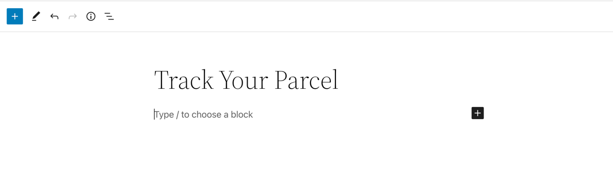

### 3. Add TrackMage Setup Widget

- ***Add code block***

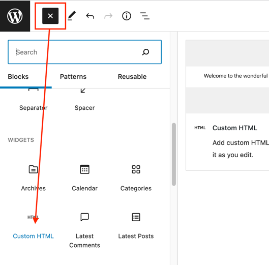

- ***Copy Setup Widget html code from the [docs](https://docs.trackmage.com/docs/tracking-widgets.html#setup-widget) and insert it into the code block***

_Copy Setup Widget code:_
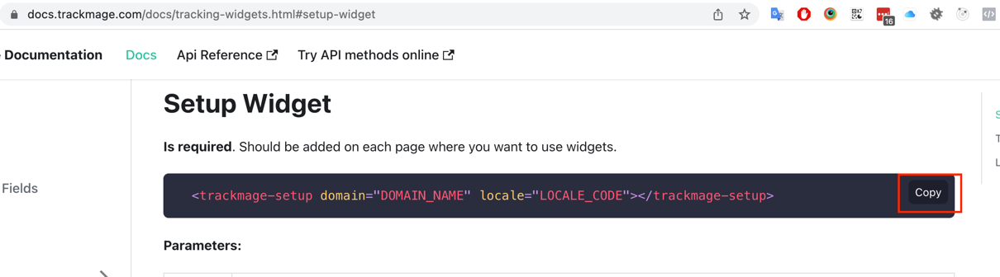

_Insert Code:_

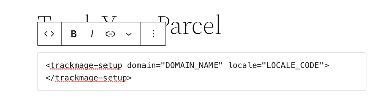

- ***Replace parameter with your values***

_Copy Tracking Page Domain:_

_In the result you should have something like below:_

:::tip
For locale parameter you can use one of ***de, en, es, fr, gr, it, pt, ru*** values.
You can delete locale parameter, in that case default locale from tracking page will be used.
:::

### 4. Add two columns

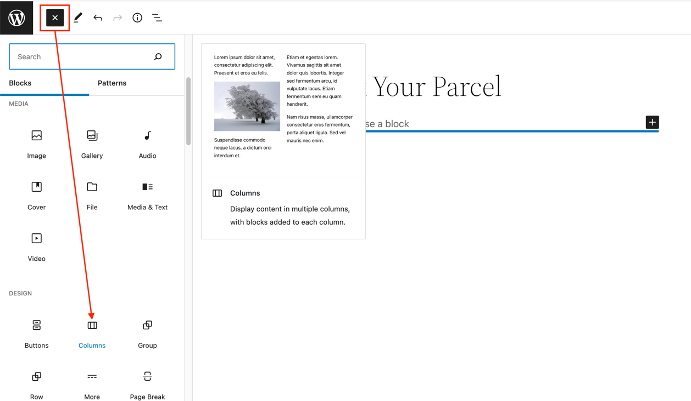

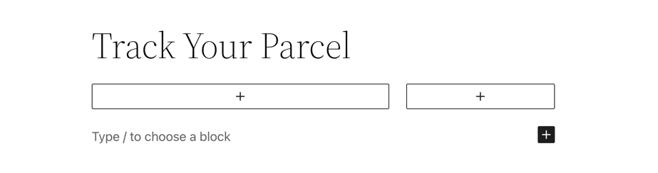

### 5. Add Lookup Widget and Tracking Cards Widget to first column

- ***Copy Lookup Widget code from the [docs](https://docs.trackmage.com/docs/tracking-widgets.html#setup-widget) and insert it***

_Copy Lookup Widget Code:_

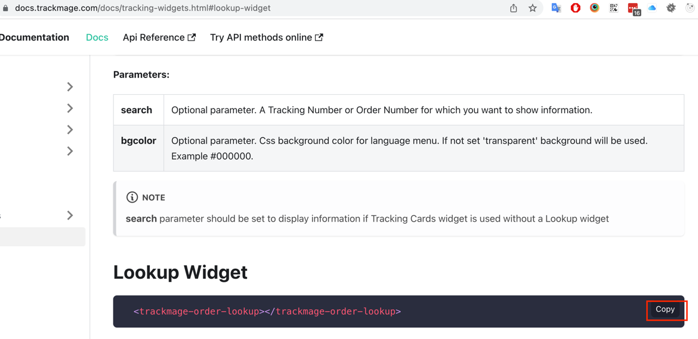

_Add widget code to first column:_

- ***Copy Tracking Cards Widget code from the [docs](https://docs.trackmage.com/docs/tracking-widgets.html#tracking-cards-widget) and insert it***

_Copy Tracking Cards Widget Code:_

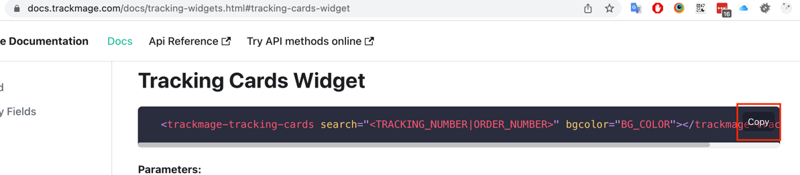

_Add widget code to first column:_

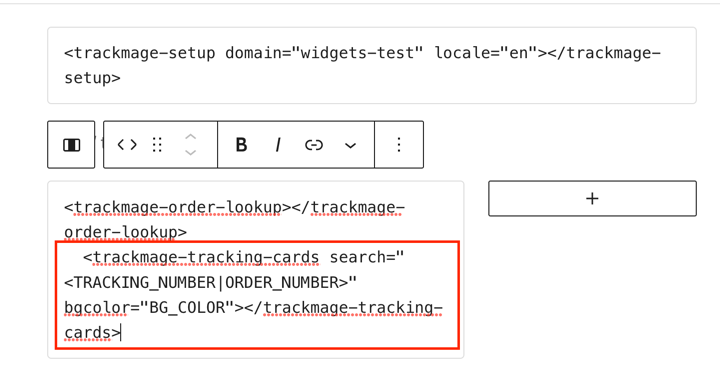

- ***In the result you should have something like below:***

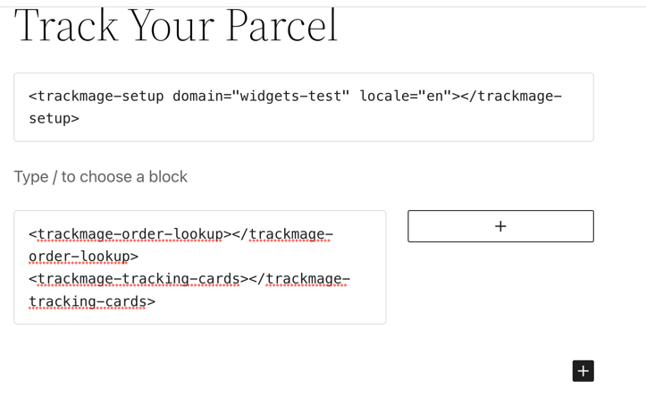

### 6. Add Sidebar Widget to second column

- ***Copy Tracking Cards Widget code from the [docs](https://docs.trackmage.com/docs/tracking-widgets.html#sidebar-widget) and insert it***

_Copy Sidebar Widget Code:_

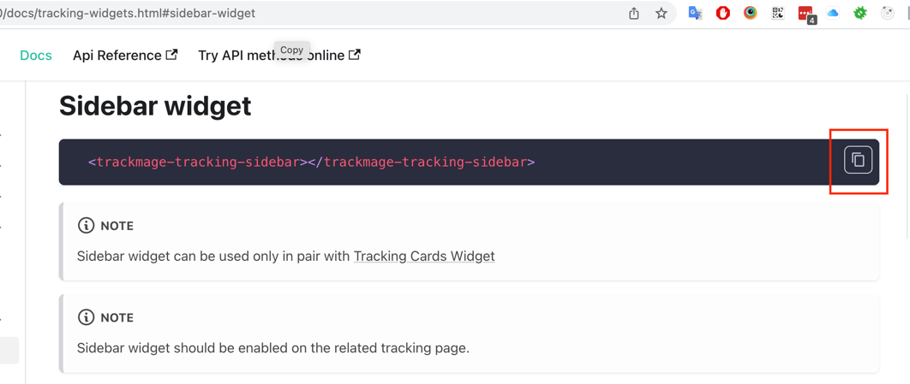

_Paste Sidebar Widget Code:_

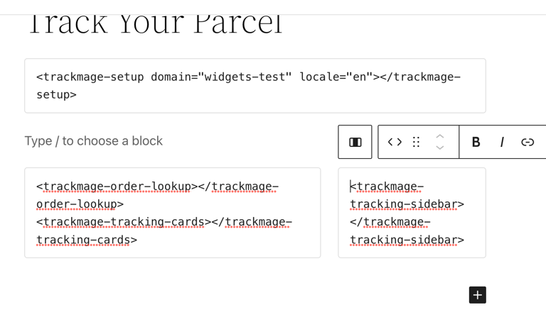

### 7. Add script code to the page

- ***Copy script code from the [docs](https://docs.trackmage.com/docs/tracking-widgets.html)***

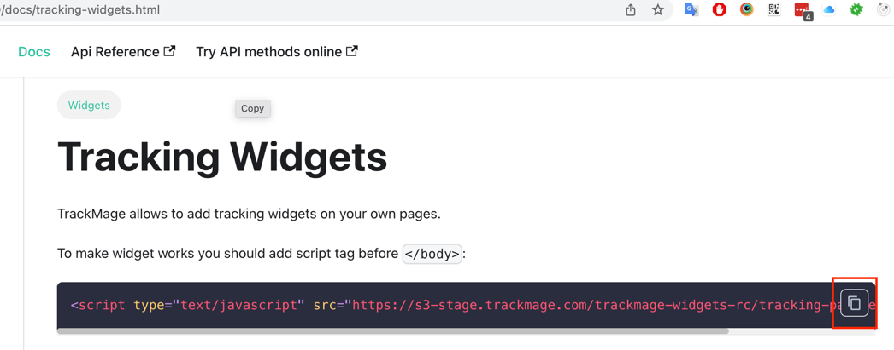

- ***Paste script code***

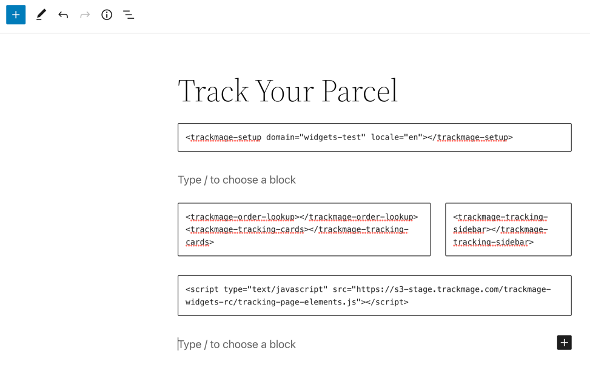

### 8. Save changes on the editor and open your page.

***If everything was added correctly, you will have working widgets on the page:***

***Test widgets work with one of your tracking/order number***

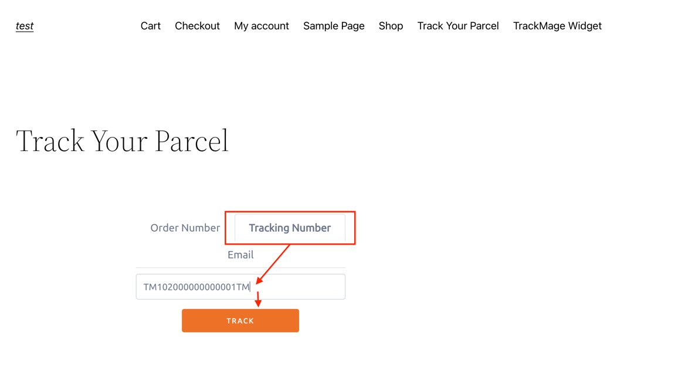

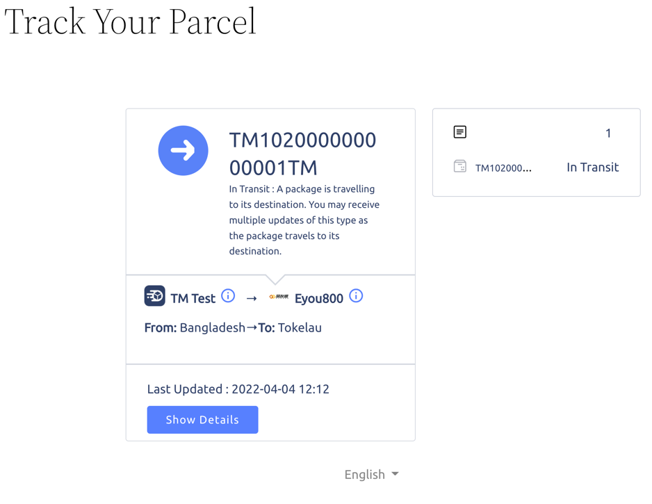

:::tip
Page layout is just example. You can use widgets in different blocks on the page.

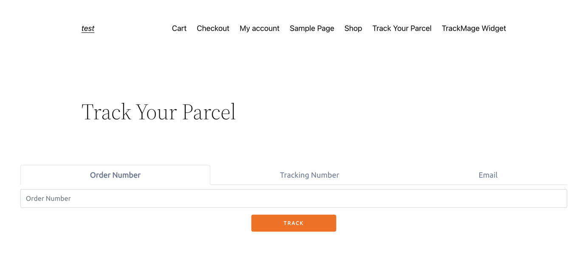

:::

